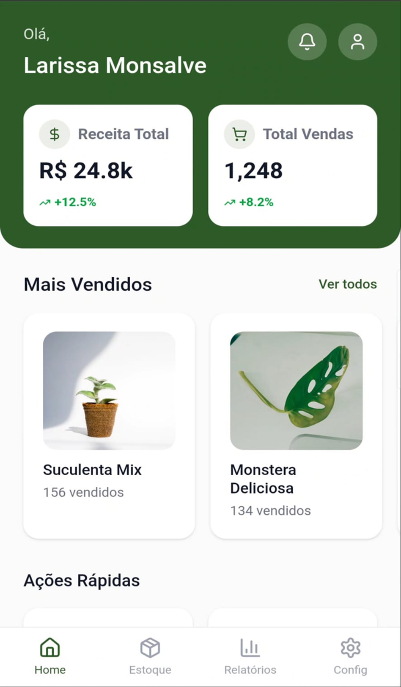
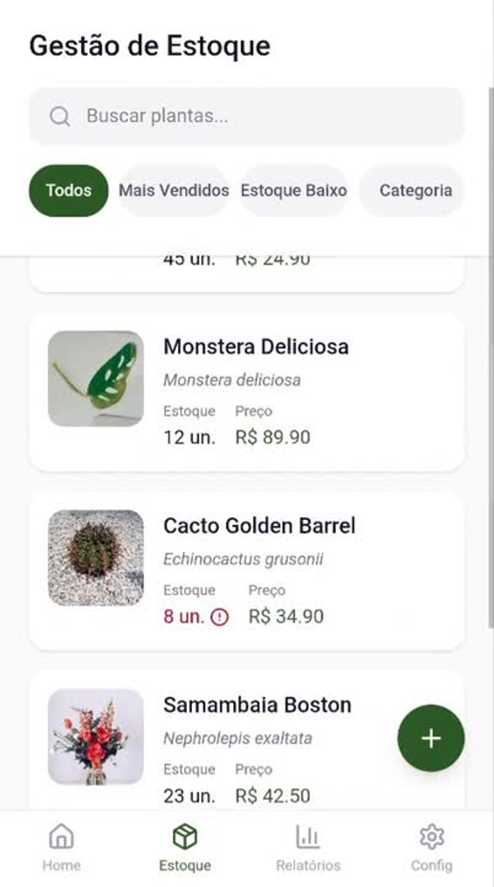
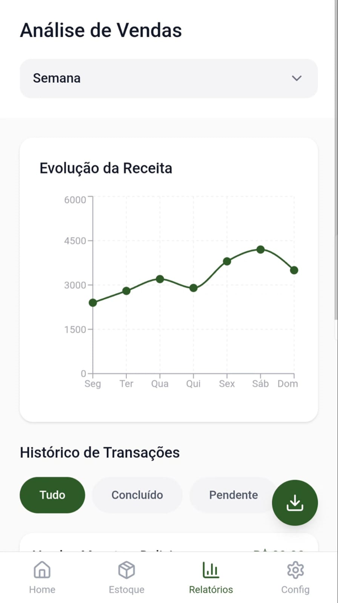

# 🌿 PlantsPin - Gestão Inteligente de Vendas

O **PlantsPin** é uma solução mobile desenvolvida para modernizar e simplificar o gerenciamento de vendas e estoque de plantas em **Parintins/AM**. O foco é substituir o controle manual por uma interface baseada em dados, permitindo que o empreendedor tome decisões estratégicas sobre receita e reposição de produtos.

---

## 🚀 Funcionalidades Principais

**Visão Geral (Dashboard)**: Visualização imediata de Receita Total, Total de Vendas e métricas de crescimento.
**Gestão de Estoque**: Monitoramento de unidades, preços e alertas visuais para estoque baixo.
**Análise de Vendas**: Gráficos intuitivos de evolução da receita semanal e histórico de transações filtrável.
**Produtos mais vendidos**: Seção dedicada às plantas mais vendidas.
**Histórico de Transações**: Filtros por status (Concluído/Pendente) para controle financeiro rigoroso.
**Administração da Loja**: Módulo de configurações para gestão de fornecedores e dados da conta.

---

## 🛠️ Tecnologias Utilizadas

* **Framework**: React Native (Expo Managed Workflow).
* **Linguagem**: TypeScript para maior segurança e escalabilidade do código.
* **Arquitetura**: Organização baseada em componentes reutilizáveis dentro da pasta src/.
* **UI/UX**: Design com foco na experiência do usuário do nicho botânico.

---

## 🎨 Interface do Usuário

| Home | Estoque | Relatórios | Configurações
| :---: | :---: | :---: | :---: |
|  |  |  | 

---

## ⚙️ Como Executar o Projeto

Para rodar este projeto localmente, você precisará do Node.js e do Expo Go instalado em seu dispositivo móvel.

1. **Clone o repositório**:
   ```bash
   git clone (https://github.com/larissamonsalve/plantspin.git)

2. **Instale as dependências**:
    ```Bash
    npm install

3. **Inicie o servidor do Expo**:
    ```Bash
    npx expo start

4. **Acesse o App: Escaneie o QR Code gerado no terminal usando o aplicativo Expo Go**.

**Nota:Este projeto foi desenvolvido por Larissa Monsalve como parte da evolução prática e acadêmica no curso de Engenharia de Software.**
